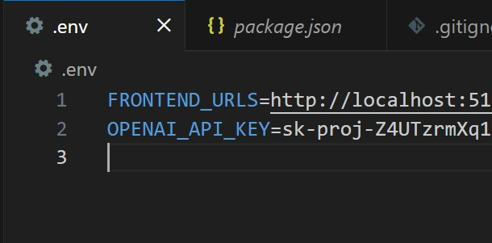

# DEMO INFO

You can freely this key use the backend of ChatGpt for this demo
Instructions:
copy the example.env file and rename to just to just .env

Then set the openAi key variable in that file to :

sk-proj

-Z4UTzrmXq1X3l1BPTYwcE4LYjyZIjGJLMQbwTW3CCT5EWFmzn15QguGCxuqeEWmHMF285FKW2KT3BlbkFJJCEK1C4l-w6rpn5eQv9xIt6GKRjtsGBfG9tcpobsRE4tLsFsHv5GAwmwjkULTnMraB78IlKk4A

So it will look like this :

-----
We'll be using react
So we'll need  Node.js from : https://nodejs.org

After installation, open a new terminal and check:

node -v
npm -v

------

We will be using a free program called Ollama as well as the free model Llama3.

Download Instructions
Mac : curl -fsSL https://ollama.com/install.sh | sh
Windows : Download from https://ollama.com/download

ollama serve
Ollama pull ollama3

------

Repos
https://github.com/camerongillette/Node-Lyric-Generator-Backend 

https://github.com/camerongillette/React-AI-Lyric-Generator-Frontend/tree/simpleFrontend

